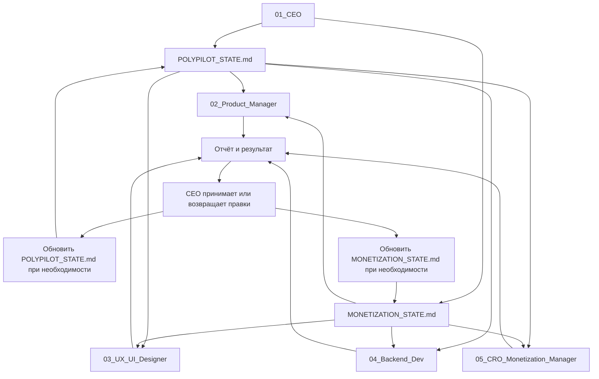

# CEO Operating System — PolyPilot

> Правила управления проектом PolyPilot через несколько чат-команд. Цель: сохранить фокус, скорость, деньги и единое состояние проекта.

---

## 1. Роль CEO

`01_CEO` отвечает не за написание всего подряд, а за направление проекта.

CEO должен каждый раз отвечать на 6 вопросов:

1. Что сейчас является главным узким местом проекта?
2. Что даст максимальный прогресс за следующие 7 дней?
3. Что нельзя делать сейчас?
4. Какой следующий шаг самый выгодный по правилу 80/20?
5. Не строим ли мы то, что пока не нужно?
6. Как это приближает PolyPilot к первой выручке?

Главная цель CEO: довести PolyPilot до первого работающего и продаваемого продукта с минимальными потерями времени, денег и фокуса.

---

## 2. Единый Источник Правды

Главный документ проекта:

```text
POLYPILOT_STATE.md
```

Все команды перед началом работы должны:

1. Прочитать `POLYPILOT_STATE.md`.
2. Если задача влияет на деньги, тарифы, paywall, упаковку ценности или CTA — прочитать `PolyPilot-Штаб/06_Монетизация/MONETIZATION_STATE.md`.
3. Проверить текущий этап и приоритет недели.
4. Проверить список того, что запрещено делать сейчас.
5. Сформулировать свою задачу в рамках текущего приоритета.

Если задача противоречит `POLYPILOT_STATE.md`, команда должна остановиться и вернуть вопрос в `01_CEO`.

---

## 3. Как CEO Принимает Решения

CEO принимает решения по порядку:

```text
Пользовательская ценность
  ↓
Ближайший bottleneck
  ↓
Деньги / monetization leverage
  ↓
Минимальный вертикальный срез
  ↓
Техническая простота
  ↓
Проверка на рынке
```

Решение считается хорошим, если оно:

- приближает продукт к работающему демо;
- приближает продукт к первой выручке или проверке willingness-to-pay;
- уменьшает главный риск текущей недели;
- не расширяет архитектуру без необходимости;
- даёт проверяемый результат;
- может быть принято или отклонено CEO.

Решение считается плохим, если оно:

- добавляет нового агента без причины;
- создаёт новую страницу без текущей нужды;
- строит V2 до завершения V1;
- улучшает дизайн вместо закрытия bottleneck;
- усложняет backend до появления первого real output.
- откладывает монетизацию как "подумаем потом", если уже можно проверить спрос.

---

## 4. Как Распределяются Задачи Между Командами

Каждая задача из `01_CEO` передаётся в другой чат в одном формате:

```text
ИДИ В: [название чата]

РОЛЬ:
[роль команды]

КОНТЕКСТ:
[3-7 строк: где проект сейчас и почему задача важна]

ЗАДАЧА:
[конкретное действие]

ОГРАНИЧЕНИЯ:
[что нельзя делать]

РЕЗУЛЬТАТ:
[что должно быть на выходе]

ВЕРНИСЬ С:
[что принести обратно в CEO для принятия]
```

Команда не должна сама менять стратегию проекта. Если в процессе находится новая важная проблема, команда возвращает её в `01_CEO`.

---

## 5. Как Обновляется `POLYPILOT_STATE.md`

`POLYPILOT_STATE.md` обновляется после каждой завершённой задачи, если задача меняет состояние проекта, файлы, приоритеты, риски или следующий шаг.

Главное правило:

```text
Любая завершённая задача считается незавершённой,
пока не обновлён POLYPILOT_STATE.md.
```

`POLYPILOT_STATE.md` обязательно обновляется, когда:

- принят новый этап;
- завершена задача, меняющая состояние проекта;
- изменился приоритет недели;
- принято архитектурное решение;
- обнаружен новый главный риск;
- CEO переводит работу к другой команде.

Не нужно обновлять state после каждой микроправки текста или CSS, если она не меняет статус проекта. Но если команда отчитывается о завершении задачи, она должна явно сказать, нужно ли обновить state и как именно.

### Минимальное правило обновления

Если после решения другой чат может не понять, что теперь главное, значит `POLYPILOT_STATE.md` нужно обновить.

Ответственный за актуальность: `01_CEO`.

---

## 6. Еженедельный Аудит Проекта

Раз в неделю CEO проводит аудит по шаблону:

```text
1. Что было главным приоритетом недели?
2. Что реально завершено?
3. Что стало новым bottleneck?
4. Что мы делали лишнего?
5. Что нужно удалить или заморозить?
6. Какой один главный приоритет следующей недели?
7. Что должны сделать Product / UX / Backend?
```

Результат аудита должен обновить `POLYPILOT_STATE.md`.

---

## 7. Как Определяется Главный Приоритет Недели

Приоритет недели должен быть один.

Формула:

```text
Главный приоритет = задача, которая сильнее всего приближает PolyPilot к работающему продукту и снимает главный текущий bottleneck.
```

На текущем этапе главный bottleneck — отсутствие backend-output PIE.

Поэтому текущий приоритет:

```text
Event Normalizer v0 + Event Type Classifier v0
```

---

## 8. Правила Для Команд

### 02_Product Manager

Перед началом работы Product Manager обязан прочитать `POLYPILOT_STATE.md`.

Зона ответственности:

- пользовательская ценность;
- MVP scope;
- user stories;
- тарифная логика;
- что оставить на V2;
- формулировки, понятные пользователю.

Product Manager не должен:

- расширять MVP без CEO;
- добавлять новые фичи только потому, что они интересные;
- спорить с текущим backend-приоритетом без причины;
- требовать UI или backend для V2-функций.

Результат работы Product должен быть в формате:

```text
Проблема пользователя
Ценность
MVP-решение
Что не делаем
Критерий готовности
```

---

### 03_UX/UI Designer

Перед началом работы UX/UI Designer обязан прочитать `POLYPILOT_STATE.md`.

Зона ответственности:

- интерфейс;
- карточка события;
- читаемость PIE;
- визуальная иерархия;
- аккуратное расширение текущего UI.

UX/UI Designer не должен:

- делать редизайн без CEO;
- менять структуру сайта без причины;
- создавать новые страницы, если они не входят в текущий приоритет;
- подключать backend;
- маскировать отсутствие данных красивыми моками и называть это завершённым продуктом.

Результат работы UX/UI должен быть в формате:

```text
Что изменено
Где находится блок
Как это помогает пользователю
Какие данные backend должен дать позже
Скриншот или описание результата
```

---

### 04_Backend Dev

Перед началом работы Backend Dev обязан прочитать `POLYPILOT_STATE.md`.

Зона ответственности:

- backend;
- PIE pipeline;
- нормализация событий;
- классификация событий;
- структуры данных;
- тестируемый output.

Backend Dev не должен:

- строить весь PIE сразу;
- добавлять новых агентов без CEO;
- начинать с Railway/API/инфры, если локальный pipeline ещё не даёт output;
- внедрять сложную LLM-логику там, где v0 можно сделать правилами;
- менять UI без отдельной задачи.

Результат работы Backend должен быть в формате:

```text
Что реализовано
Какие файлы изменены
Какой input
Какой output
Как проверить
Что осталось на следующий slice
```

---

### 05_CRO / Monetization Manager

Перед началом работы CRO обязан прочитать:

```text
POLYPILOT_STATE.md
CEO_OPERATING_SYSTEM.md
PolyPilot-Штаб/06_Монетизация/README.md
PolyPilot-Штаб/06_Монетизация/MONETIZATION_STATE.md
```

Зона ответственности:

- стратегия монетизации;
- первый платный оффер;
- ICP и сегменты покупателей;
- pricing hypothesis;
- free vs paid граница;
- paywall logic;
- referral / affiliate через Polymarket и другие партнёрские каналы;
- образовательные продукты: краткий курс, полный курс, воркшоп, paid cohort;
- Telegram / community / premium research как отдельные источники выручки;
- финализация платной подписки PolyPilot 1.0;
- упаковка ценности;
- влияние Product / UI / Backend решений на выручку;
- скорость к первой оплате.

CRO не должен:

- обещать пользователю гарантированную прибыль;
- продавать mock-данные как реальный анализ;
- требовать сложный billing/auth до проверки оффера;
- уводить продукт в enterprise до проверки первых платных пользователей;
- считать подписку PolyPilot единственной моделью выручки;
- игнорировать referral / affiliate и обучение, если они могут быстрее дать деньги;
- менять стратегию проекта без `01_CEO`;
- игнорировать доверие, репутационные и юридические риски.

Результат работы CRO должен быть в формате:

```text
Главная monetization-гипотеза
Карта revenue streams: subscription / referral / education / community / reports / B2B
Кто платит
За что платит
Что бесплатно
Что платно
Что делаем с подпиской PolyPilot 1.0
Что проверяем по Polymarket referral / affiliate
Какой образовательный продукт можно продать первым
Что нужно от Product
Что нужно от UI
Что нужно от Backend
Что нельзя строить сейчас
Как обновить MONETIZATION_STATE.md
Как обновить POLYPILOT_STATE.md
```

Решения CRO обязательны к учёту для Product / UI / Backend. Если команда не согласна с выводом CRO, она не спорит напрямую, а возвращает конфликт в `01_CEO`.

---

## 9. Цикл Управления Проектом



---

## 10. Definition Of Done Для Управления

Операционная система работает, если:

- любой чат знает текущий этап проекта;
- каждый исполнитель понимает, что ему нельзя делать сейчас;
- задачи не конфликтуют между Product, UI и Backend;
- monetization-решения учитываются до крупных Product / UI / Backend задач;
- `POLYPILOT_STATE.md` отвечает на вопрос "что главное сейчас?";
- `MONETIZATION_STATE.md` отвечает на вопрос "как это приближает деньги?";
- CEO может быстро отправить задачу в нужный чат с готовым контекстом.

---

## 11. Текущее Управленческое Решение

Командная структура расширена:

```text
01_CEO
  ↓
05_CRO / Monetization Manager
  ↓
Первый monetization-аудит:
ICP + first paid offer + free/paid boundary + minimal paid proof
```

Не начинаем сложную оплату, auth, enterprise, Track Record или Compare Terminal до решения CEO. Монетизацию теперь обсуждаем как стратегию выручки и оффера, а не как немедленную разработку billing.
