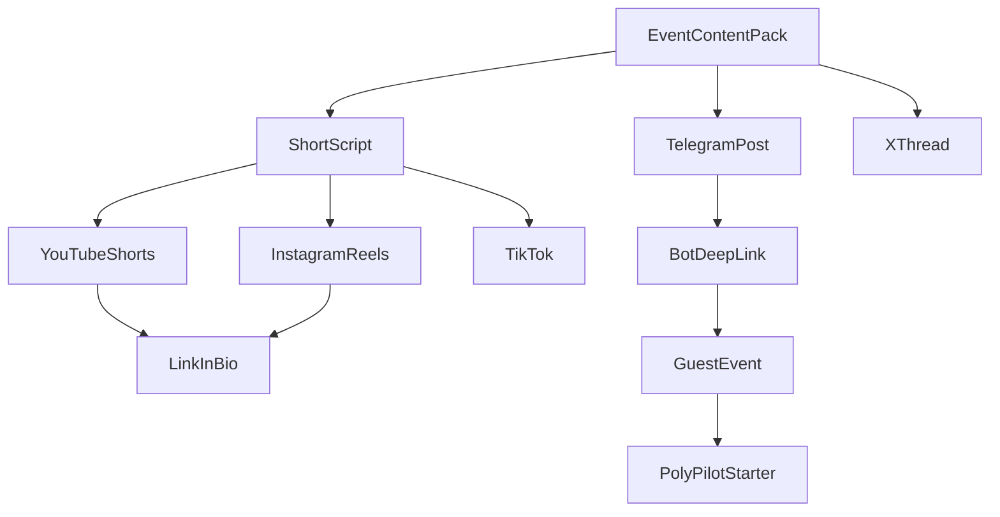

# Channel Stack — Funnel 1.0

> Стартовый набор каналов, syndication-порядок и объёмы публикаций для широкого охвата без распыления.

---

## Принцип

```text
3–4 core channels + 2–3 syndication channels.
Не 20 аккаунтов вручную — один Event Pack → много форматов.
```

---

## Core Channels (запуск сразу)

| # | Канал | Роль | Язык | Частота | Owner |
|---|-------|------|------|---------|-------|
| 1 | **Telegram Channel RU** | Hub: daily posts, breakdowns, CTA | RU | 1 post/day + event CTA | CRO/Marketing |
| 2 | **Telegram Bot** | 72h nurture, intent, Starter applications | RU | triggered | CRO/Marketing |
| 3 | **YouTube Shorts** | Main video reach: education + hot events | RU | 1–2/day | Content |
| 4 | **X / Twitter** | Threads, charts, global discovery | RU + EN mix | 1 thread + 2–3 tweets/day | Content |

---

## Syndication Channels (переупаковка из Core)

| # | Канал | Роль | Частота | Примечание |
|---|-------|------|---------|------------|
| 5 | **Instagram Reels** | Duplicate Shorts + carousels | 1/day | link in bio → TG |
| 6 | **TikTok** | Duplicate Shorts if compliance OK | 1/day | same scripts |
| 7 | **PolyPilot guest-event** | 60–90 sec wow, conversion surface | per event | real data only |

---

## Launch Later (Phase 2+)

| Канал | Когда | Условие |
|-------|-------|---------|
| YouTube long-form (8–15 min) | Phase 2 | 5+ winning Shorts, Starter sales |
| Reddit (r/predictit, crypto subs) | Phase 2 | no spam policy, value posts only |
| Discord community | Phase 2 | after TG hub traction |
| Lens / Farcaster | Phase 2 | if crypto segment converts |
| SEO / blog | Phase 3 | evergreen pages |
| Global EN X + Shorts | Phase 3 | RU proof complete |

---

## Brand Mapping By Channel

| Channel | Brand voice |
|---------|-------------|
| TG Channel | PolyPilot Radar — event-driven, useful |
| TG Bot | PolyPilot — nurture + Starter offer |
| Shorts/Reels/TikTok | Radar — hooks, education, news |
| X | Radar + method threads |
| guest-event | PolyPilot Official — analytical, disclaimers |
| learn.html | PolyPilot Official — education |

---

## Syndication Flow



---

## Publishing Volumes — Week 1 Target

| Channel | Posts/week | Notes |
|---------|------------|-------|
| Telegram Channel | 7 | 1/day minimum |
| Telegram Bot | triggered | per new subscriber |
| YouTube Shorts | 7–14 | remix winners |
| Instagram Reels | 5–7 | syndication |
| TikTok | 5–7 | if active |
| X | 7 threads + 14 tweets | mix RU/EN on hot events |
| Event Packs produced | 5 | see STARTER_ASSETS |

**Total content pieces from 5 packs:** ~5 × (3 scripts + 3 TG + 1 thread + 4 visuals) = **55 assets/week** with automation/remix.

---

## Link Architecture

| Destination | URL pattern | UTM |
|-------------|-------------|-----|
| Guest event | `guest-event.html?id={event_id}` | `utm_source={channel}` |
| Telegram channel | `t.me/polypilot_pro` | — |
| Telegram bot | `t.me/polypilot_pro_bot?start=event_{id}` | `start=payload` |
| Starter offer | manual / landing TBD | `utm_campaign=starter` |
| Learn | `app/learn.html` | `utm_source=content` |

---

## Paid Traffic (Phase 1.5 only)

Не лить большие бюджеты до проверки messaging.

| Channel | Test budget | Goal |
|---------|-------------|------|
| TG Ads | small | channel joins |
| X promoted | small | thread engagement |
| Shorts boost | small | TG bio clicks |

Stop if: negative comments > 5%, CAC > 2× target, «scam» mentions spike.

---

## Account Setup Checklist

- [ ] Telegram Channel RU created + description + disclaimer
- [ ] Telegram Bot created + 72h sequence wired
- [ ] YouTube channel + Shorts playlist
- [ ] X account + pinned thread (what is PolyPilot)
- [ ] Instagram business + link in bio → TG
- [ ] TikTok (optional) + same bio link
- [ ] Unified visual template (probability card, risk card, CTA card)
- [ ] Analytics sheet: views, joins, bot starts, Starter applications

---

← [README.md](README.md) · [BOT_SEQUENCE_72H.md](BOT_SEQUENCE_72H.md)
