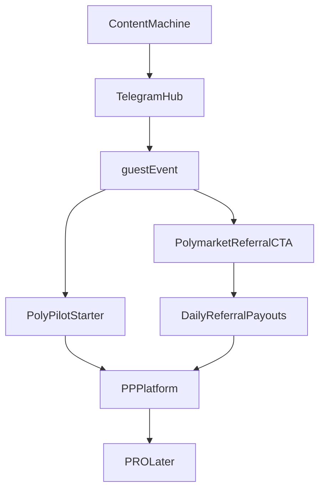

# Polymarket Referral — анализ для CEO

> CRO-оценка реферальной программы Polymarket как источника выручки PolyPilot.  
> **Дата:** 2026-06-14 · **Автор:** `05_CRO / Monetization Manager`  
> **Статус:** утверждено CEO (2026-06-14)

---

## Executive Summary

Получены актуальные условия referral-программы Polymarket. PolyPilot **может** начать получать выручку раньше PRO-подписки, но **не раньше и не стабильнее**, чем через `PolyPilot Starter`, если рефералы не торгуют активно.

**Рекомендация CRO:**

```text
1. Контент-машину строить СЕЙЧАС — да.
2. Строить её ВОКРУГ referral как главной модели — нет.
3. Referral = secondary revenue layer после разбора, не core business.
4. Primary monetization proof остаётся: PolyPilot Starter.
5. Dual-track: Track A (Starter) + Track B (referral после $10k volume gate).
```

**Полный документ для CEO:** этот файл.  
**Краткий статус в state:** [MONETIZATION_STATE.md](MONETIZATION_STATE.md)

---

## Актуальные Условия Polymarket Referral

### Доступ к реферальной ссылке

```text
Lifetime Trading Volume > $10 000
```

Операционная задача до старта referral-монетизации: набрать $10k lifetime volume на Polymarket.

### Уровень 1

- **30%** торговых комиссий приглашённых пользователей.

### Уровень 2

- **10%** комиссий, если приглашённый привёл другого пользователя.

### Срок выплат

- **180 дней** после регистрации реферала.

### Выплаты

- **Ежедневно.**

### Ограничения

- Лимита по количеству рефералов **нет**.

---

## Главный Вывод По Механике

Referral monetization зависит не от регистраций, а от **trading volume**:

```text
Referral revenue = f(регистрации × trading volume × fee rate × 30% × активность 180 дней)
```

**Не:** `f(просмотры × CTR)`.

---

## Грубая Экономика (гипотеза для планирования)

> Не обещание дохода. Эффективная комиссия платформы — рабочая оценка ~1% от оборота; PolyPilot получает 30% → **~0.3% от trading volume реферала**.

| Trading volume реферала за 180 дней | Гипотетическая выручка PolyPilot (L1) |
|---------------------------------------|---------------------------------------|
| $500 | ~$1.5 |
| $2 000 | ~$6 |
| $10 000 | ~$30 |
| $50 000 | ~$150 |

### Сравнение с PolyPilot Starter

| Модель | Один «успешный» пользователь |
|--------|------------------------------|
| **PolyPilot Starter** | 4 990–9 990 ₽ (~$50–100+) сразу |
| **Referral (casual)** | часто $1–10 за 6 месяцев |
| **Referral (active trader)** | может быть $30–150+ за 6 месяцев |

**1 оплата Starter** часто равна **десяткам–сотням** casual referral users.

---

## Схема: Referral В Общей Воронке

```text
Shorts / Reels / X / Telegram
        ↓
   Telegram Hub + Bot (прогрев)
        ↓
   guest-event / разбор события
        ↓
   ┌─────────────────┬──────────────────────┐
   │ Track A         │ Track B              │
   │ PolyPilot       │ CTA «Open on         │
   │ Starter         │ Polymarket»          │
   │ (primary)       │ (secondary, после    │
   │                 │ $10k vol gate)       │
   └─────────────────┴──────────────────────┘
        ↓                      ↓
   Платформа PP          Referral payouts (daily)
        ↓
   Early Access → PRO (later)
```



---

## Ответ: Строить Ли Контент-Машину Вокруг Referral Сейчас?

### Да — контент-машину строить

Без неё нет аудитории, прогрева, данных по hooks и базы для Starter **и** referral одновременно.

См. также: [FUNNEL_1_0/README.md](../05_Маркетинг/FUNNEL_1_0/README.md)

### Нет — не делать referral центром контент-машины

Referral-first контент превращает PolyPilot в affiliate / tipster funnel и ломает:

- доверие к аналитике;
- продажи Starter и PRO;
- долгосрочный бренд «research engine».

### Правильная Последовательность

| Фаза | Действие | Referral |
|------|----------|----------|
| **0. Сейчас** | Контент: события, education, TG, guest-event | Не главный CTA. Путь к $10k volume. |
| **1. После $10k volume** | Мягкий CTA после разбора + disclosure | Tracking, A/B copy |
| **2. После 30 дней данных** | Rev per 1000 views / per TG join | Решение: усилить referral или Starter |
| **3. После Starter proof** | Dual monetization | Разные сегменты — разные офферы |

---

## Бизнес-Оценка

### Referral сильнее Starter, когда:

- viral macro/politics event → много переходов, часть сразу торгует;
- crypto/degen аудитория с высоким volume у малого %;
- global EN scale (мало платят за курс, но торгуют);
- cold traffic с низким WTP (не купят Starter, но зарегистрируются).

### Referral слабее Starter, когда:

- новички хотят понять, не торговать → signup без volume = $0;
- RU education-first аудитория;
- analytical brand positioning;
- до $10k volume — модель недоступна.

### Вердикт

| Вопрос | Ответ |
|--------|-------|
| Referral — самый быстрый путь к деньгам? | **Возможно**, если есть ссылка + active traders; **не гарантированно** |
| Referral — самый монетизируемый long-term? | **Нет** — owned products (Starter, PRO, B2B) сильнее |
| Referral — единственная модель? | **Нет** — accelerator, not core |
| Масштабируемость? | **Высокая**, но зависимая от Polymarket |
| Долгосрочный moat? | **Слабый** — partner rev share, не owned revenue |

---

## Стратегическая Роль Referral

```text
Owned revenue (Starter, PRO, reports, course, B2B)
  +
Partner revenue (Polymarket referral)
```

**Referral = accelerator, not core business.**

| Роль | Оценка |
|------|--------|
| Первый cash flow | ⭐⭐⭐⭐ возможно |
| Основной бизнес | ⭐⭐ опасно |
| Масштаб без большой команды | ⭐⭐⭐⭐ |
| Защита бренда (при правильном CTA) | ⭐⭐⭐ |
| Долгосрочный moat | ⭐ |

---

## Brand Guardrails Для Referral CTA

### Правильно

```text
«Открыть это событие на Polymarket →»
+ disclaimer: не финансовый совет, риск потери средств
+ disclosure: PolyPilot может получать часть комиссии (если требуется правилами)
```

### Неправильно

- «Зарегистрируйся и заработай»
- «Сигнал: ставь YES»
- «300% на prediction markets»

См. [FUNNEL_1_0/BRAND_GUARDRAILS.md](../05_Маркетинг/FUNNEL_1_0/BRAND_GUARDRAILS.md)

---

## Dual-Track Monetization (рекомендация CEO)

```text
Track A (primary):  контент → TG → PolyPilot Starter
Track B (secondary): контент → разбор → Polymarket referral (после $10k vol)
Track C (later):     PP platform → Early Access → PRO
```

---

## KPI На Первые 60 Дней

| KPI | Target |
|-----|--------|
| Starter payments | 5–10 |
| Polymarket referral link unlocked | $10k lifetime volume |
| Referral signups | baseline |
| Trading volume from referrals | **главная метрика referral** |
| Referral revenue / 1000 TG joins | compare vs Starter ARPU |
| Negative feedback («scam/signal») | < 5% |

---

## Что Нужно От CEO

1. **Утвердить dual-track:** Starter primary, referral secondary.
2. **Утвердить:** контент-машина стартует сейчас, но не как referral-машина.
3. **Поручить:** план набора $10k lifetime volume для unlock referral link.
4. **Решить:** disclosure формулировку для CTA (affiliate disclosure).
5. **Не pivot:** PRO и PIE остаются в roadmap; referral не заменяет product.

---

## Что Нужно От Команд

### Product

- User stories: referral CTA после разбора, не до.
- Разделить flows: education → Starter vs analysis → Polymarket.

### UI

- Кнопка «Open on Polymarket» на guest-event / event card после контекста.
- Disclaimer + affiliate disclosure рядом с CTA.

### Backend

- Простой click tracking по каналам (UTM / event) — **после решения CEO**.
- Не строить сложный referral dashboard до первых данных.

### Marketing

- Контент-машина по [FUNNEL_1_0](../05_Маркетинг/FUNNEL_1_0/README.md).
- Referral-ready CTAs в Event Content Pack, не в hooks Shorts.

---

## Предложение Обновления POLYPILOT_STATE.md

```text
## Monetization update

CRO зафиксировал анализ Polymarket referral:
PolyPilot-Штаб/06_Монетизация/POLYMARKET_REFERRAL_ANALYSIS.md

Решение CRO (ожидает CEO):
- dual-track: Starter primary, referral secondary после $10k volume gate
- контент-машину строить сейчас, не вокруг referral как core
- referral = accelerator, not core business
```

---

← [MONETIZATION_STATE.md](MONETIZATION_STATE.md) · [FIRST_MONETIZATION_AUDIT.md](FIRST_MONETIZATION_AUDIT.md) · [FUNNEL_1_0](../05_Маркетинг/FUNNEL_1_0/README.md)
