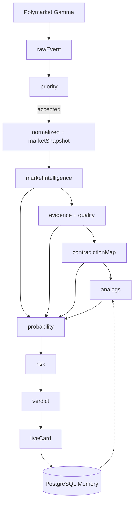

# Intelligence Engine — поток данных (Data Flow)

> [[PROBABILITY_INTELLIGENCE_ENGINE]] · [[INTELLIGENCE_ENGINE_MVP]] · [[СХЕМА_ДАННЫХ_СОБЫТИЯ]]

> **Статус:** ✅ зафиксирован — ОК основателя 9 июня 2026  
> **Версия:** `flow_v1` · **Дата:** 9 июня 2026

---

## Зачем отдельный документ

Архитектура говорит **кто**.  
Этот документ — **что именно** передаётся между модулями: тип данных, shape JSON, обязательные поля.

---

## Общая схема потока

```text
Polymarket API
      ↓
  rawEvent JSON
      ↓
 Priority Gate ──→ rejected? STOP
      ↓
 Event Normalizer
      ↓
 normalizedEvent + marketSnapshot
      ↓
 Market Intelligence ──→ marketIntelligence
      ↓
 Evidence Collector ──→ evidence
      ↓
 Comment Analysis (5.5A/B/C) ──→ crowdPulse
      ↓
 Contradiction Engine ──→ contradictionMap
      ↓
 Comparable Events ──→ analogs[]  (+ read Memory)
      ↓
 Probability Engine ──→ probability { ppProb, edgePp, components }
      ↓
 Risk Officer ──→ risk { riskLevel, flags }
      ↓
 Verdict Agent ──→ verdict
      ↓
 Publishing ──→ liveCard (site)
      ↓
 Memory ──→ predictionRecord (PostgreSQL)
```

**Накопительный пакет:** каждый шаг **добавляет** блок к `pipelinePackage`, не затирает предыдущие.

---

## Шаг 0 — Polymarket → rawEvent

**Источник:** Gamma API · `normalize_event()` в `polymarket.py`

```json
{
  "id": "51456",
  "slug": "will-x-happen",
  "title": "Will X happen by December 31?",
  "description": "Resolves YES if … UMA …",
  "category": "Politics",
  "volume": 125000,
  "volume24hr": 4200,
  "liquidity": 85000,
  "endDate": "2026-12-31T00:00:00Z",
  "markets": [{
    "question": "Will X happen by December 31?",
    "outcomePrices": ["0.44", "0.56"]
  }],
  "source": "polymarket_gamma",
  "sourceUrl": "https://polymarket.com/event/will-x-happen"
}
```

---

## Шаг 1 — Priority Gate

**Модуль:** `priority.py`  
**Выход добавляет:**

```json
{
  "priority": {
    "agent": "Priority Agent",
    "score": 78,
    "decision": "accepted",
    "reason": "RU string",
    "gates": { "liquidityOk": true, "volumeOk": true }
  }
}
```

**STOP если** `decision === "rejected"` → pipeline не продолжается.

---

## Шаг 2 — Event Normalizer

**Вход:** rawEvent + priority  
**Выход добавляет:**

```json
{
  "normalized": {
    "eventId": "51456",
    "titleRu": "Состоится ли X до 31 декабря?",
    "resolutionCriteria": "YES если … по данным UMA",
    "decisionMaker": "UMA / Polymarket",
    "horizonDays": 205,
    "flags": []
  },
  "marketSnapshot": {
    "marketProb": 44,
    "volume24h": 4200,
    "liquidity": 85000,
    "priceChange24h": 2.1,
    "spread": 1.2
  }
}
```

**STOP / branch если** `flags` содержит `resolution_unclear`.

---

## Шаг 3 — Market Intelligence

**Вход:** normalized + marketSnapshot  
**API v0:** Polymarket Analytics, Unusual Whales  
**Выход добавляет:**

```json
{
  "marketIntelligence": {
    "whaleSignal": "accumulation_yes",
    "confidence": 72,
    "smartMoneyBias": "yes",
    "anomalies": [{
      "type": "volume_spike",
      "description": "5 top wallets net YES over 6h",
      "severity": "medium"
    }],
    "sourcesUsed": ["polymarket_analytics", "unusual_whales"],
    "windowHours": 6
  }
}
```

**Если API недоступны:** `whaleSignal: "unknown"`, `sourcesUsed: []` → Probability downweights whale component.

---

## Шаг 4 — Evidence Collector

**Вход:** normalized (titleRu → search queries)  
**API v0:** News, Google Trends, X Search  
**Выход добавляет:**

```json
{
  "evidence": {
    "news": [{
      "source": "Reuters",
      "date": "2026-06-08",
      "claim": "…",
      "reliability": "A",
      "url": "https://…"
    }],
    "trends": [{
      "query": "X election",
      "index": 64,
      "delta7d": 12
    }],
    "social": [{
      "platform": "x",
      "signal": "neutral",
      "sentiment": 0.1
    }],
    "official": [],
    "historical": []
  },
  "quality": {
    "sourcesCount": 4,
    "freshnessHours": 18,
    "contradictionsFound": 0
  }
}
```

---

## Шаг 5.5 — Comment Analysis (5.5A / 5.5B / 5.5C)

> Полная спецификация: [[COMMENT_ANALYSIS_V1]]

**Вход:** normalized + evidence (контекст события)  
**Выход добавляет:** `crowdPulse` — **три отдельных блока**, не один общий sentiment.

```json
{
  "crowdPulse": {
    "status": "ready",
    "maxWeightPct": 10,
    "marketComments": {
      "commentCount": 47,
      "lean": "no",
      "argumentsYes": ["…"],
      "argumentsNo": ["…"],
      "resolutionDispute": true,
      "hasSourceLinks": true,
      "noiseSignals": ["resolve_rules_debate"],
      "quality": "medium",
      "noiseLevel": "high",
      "summaryRu": "…",
      "weightPct": 4,
      "dataSource": "polymarket_comments_stub"
    },
    "socialDiscussion": {
      "sources": [{ "platform": "x", "found": true, "activityTrend": "rising" }],
      "lean": "yes",
      "arguments": ["…"],
      "freshFacts": false,
      "viralHype": true,
      "expertSources": false,
      "quality": "medium",
      "noiseLevel": "medium",
      "summaryRu": "…",
      "weightPct": 3,
      "dataSource": "social_stub"
    },
    "synthesis": {
      "alignment": "divergent",
      "contradiction": "…",
      "repeatedArgument": "…",
      "mainRiskFromDiscussion": "…",
      "forecastImpact": "weak_positive",
      "probabilityAdjustPct": 2,
      "summaryRu": "…",
      "totalWeightPct": 5,
      "passToRiskOfficer": ["resolutionDispute"]
    },
    "scoringMode": "mock_v1"
  }
}
```

**Правила:**

- A = только комментарии под событием Polymarket.
- B = только внешние источники (X, Reddit, YouTube, Telegram, медиа).
- C = сравнение A и B; max weight **10%** на PP probability.
- Спорный резолв / сильный риск → `passToRiskOfficer`.

**MVP:** mock для event `79061`; API collectors — заглушки.

---

## Шаг 5 — Contradiction Engine

**Вход:** marketSnapshot + marketIntelligence + evidence  
**Выход добавляет:**

```json
{
  "contradictionMap": [{
    "id": "c1",
    "type": "flow_without_news",
    "marketSays": "45% neutral momentum",
    "otherSays": "whale accumulation YES 6h",
    "severity": "medium",
    "adjustmentHint": "+8pp yes"
  }]
}
```

---

## Шаг 6 — Comparable Events

**Вход:** normalized + evidence + **Memory query**  
**Выход добавляет:**

```json
{
  "analogs": [{
    "analogId": "pm-12345",
    "title": "Similar event 2024",
    "outcome": "yes",
    "similarity": 0.71,
    "baseRate": 0.58
  }]
}
```

---

## Шаг 7 — Probability Engine

**Вход:** все блоки выше  
**Выход добавляет:**

```json
{
  "probability": {
    "marketProb": 44,
    "ppProb": 57,
    "edgePp": 13,
    "components": {
      "market_base": 44,
      "whale_signal": 52,
      "news_signal": 48,
      "social_signal": 50,
      "trends_signal": 55,
      "historical_base_rate": 58,
      "contradiction_adjustment": 4
    },
    "modelVersion": "pie_v1",
    "weightsVersion": "intelligence_v1.1"
  }
}
```

**Формула:** [[AI_ARCHITECTURE_V1]] §4.2

---

## Шаг 8 — Risk Officer

**Вход:** pipelinePackage целиком  
**Выход добавляет:**

```json
{
  "risk": {
    "riskScore": 42,
    "riskLevel": "medium",
    "flags": [
      "flow_without_news_confirmation",
      "single_source_news"
    ]
  }
}
```

---

## Шаг 9 — Verdict Agent

**Вход:** probability + risk + contradictionMap (summary)  
**Выход добавляет:**

```json
{
  "verdict": {
    "agent": "Verdict Agent",
    "ppVerdict": "RU: 2–4 предложения с edge и главным риском",
    "confidence": 68,
    "status": "ready",
    "edgeScore": 13
  }
}
```

---

## Шаг 10 — Publishing → liveCard

**Pre-publish gate** → если pass:

```json
{
  "liveCard": {
    "eventId": "live-51456",
    "titleRu": "…",
    "marketProb": 44,
    "ppProb": 57,
    "edgePp": 13,
    "riskLevel": "medium",
    "verdictShort": "…",
    "publishedAt": "ISO8601"
  }
}
```

**Куда:** `platform/data/events-live.js`, `GET /api/live/events`

**Guest/Pulse/PRO поля:** [[AI_ARCHITECTURE_V1]] §7

---

## Шаг 11 — Memory (PostgreSQL)

**После publish:**

```json
{
  "memoryRecord": {
    "recordId": "uuid",
    "eventId": "live-51456",
    "publishedAt": "ISO8601",
    "marketProbAtPublish": 44,
    "ppProbAtPublish": 57,
    "edgePp": 13,
    "whaleSignalAtPublish": "accumulation_yes",
    "verdict": "…",
    "riskLevel": "medium",
    "modelVersion": "pie_v1",
    "pipelineSnapshot": "hash or json ref"
  }
}
```

**После резолва PM:**

```json
{
  "resolution": {
    "recordId": "uuid",
    "resolvedAt": "ISO8601",
    "outcome": "yes",
    "ppWasCorrect": true,
    "brierScore": 0.12,
    "errorTags": []
  }
}
```

→ feed **Comparable** + **Autopsy** + quarterly weight review.

---

## Полный pipelinePackage (контейнер)

```json
{
  "eventId": "51456",
  "source": "polymarket_gamma",
  "priority": { },
  "normalized": { },
  "marketSnapshot": { },
  "marketIntelligence": { },
  "evidence": { },
  "quality": { },
  "contradictionMap": [ ],
  "analogs": [ ],
  "probability": { },
  "risk": { },
  "verdict": { },
  "ui": { },
  "publishedAt": null
}
```

**Файл контракта v0:** расширить [[СХЕМА_ДАННЫХ_СОБЫТИЯ]] после DoD этого документа.

---

## Диаграмма потока (Mermaid)



---

## Definition of Done — Data Flow ✅

**Закрыто:** 9 июня 2026.

- [x] Каждый шаг: вход/выход без «магии»
- [x] STOP-ветки (rejected, resolution_unclear) согласованы
- [x] [[СХЕМА_ДАННЫХ_СОБЫТИЯ]] обновлена под pipelinePackage
- [x] Backend может писать Normalizer без «а что дальше»

---

← [[PROBABILITY_INTELLIGENCE_ENGINE]] · [[INTELLIGENCE_ENGINE_MVP]]
