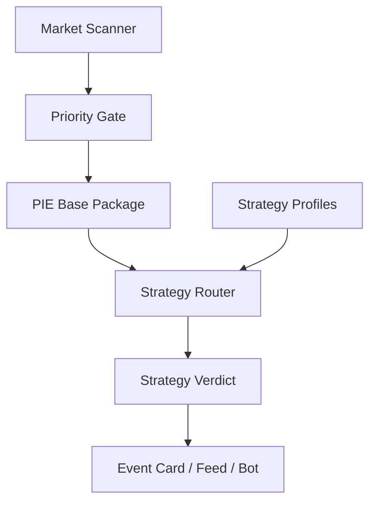

# Strategy Intelligence Layer v1.0

> [[AI_ARCHITECTURE_V1]] · [[PROBABILITY_INTELLIGENCE_ENGINE]] · [[INTELLIGENCE_ENGINE_MVP]] · [[INTELLIGENCE_DATA_FLOW]] · [[ДОРОЖНАЯ_КАРТА_ОНЛАЙН]]

> **Статус:** master-документ · зафиксирован CEO 14 июня 2026  
> **Версия:** `strategy_intelligence_v1.0`  
> **Роль:** связать аналитику PolyPilot с конкретными торговыми стратегиями Polymarket

---

## Главный тезис

PolyPilot не должен быть просто лентой “интересных событий Polymarket”.

Правильная продуктовая формула:

```text
Polymarket events
  → общий PIE-анализ
  → Strategy Intelligence Layer
  → событие попадает в одну или несколько торговых стратегий
  → пользователь видит вывод внутри конкретного setup
```

**PIE** отвечает на вопрос:

```text
Что это за событие, что говорят деньги, факты, рынок, история и риск?
```

**Strategy Intelligence Layer** отвечает на вопрос:

```text
Зачем это событие вообще выбрано и под какую торговую логику оно подходит?
```

---

## Что меняется в философии PP

### Было

```text
Вот события Polymarket, которые кажутся важными.
```

### Должно быть

```text
Вот события, которые подходят под конкретные trading setups.
```

Это ключевой сдвиг. Без Strategy Layer PolyPilot рискует стать красивой аналитической витриной. Со Strategy Layer PP становится системой поиска и объяснения торговых setup.

---

## Место Strategy Layer в архитектуре

Strategy Layer не заменяет PIE и не создаёт отдельную мясорубку под каждую стратегию.

PIE остаётся общим мозгом. Strategy Layer работает как набор линз и фильтров поверх общего evidence package.



---

## Новый слой: Strategy Router

**Strategy Router** — агент/модуль, который получает `pipelinePackage` от PIE и определяет:

- подходит ли событие под конкретную стратегию;
- какая стратегия primary;
- какие стратегии secondary;
- почему событие попало в ленту;
- какие факторы invalidation;
- какой тип вывода нужен пользователю.

Пример выхода:

```json
{
  "strategyIntelligence": {
    "primaryStrategy": "whale_copy",
    "strategyFits": [
      {
        "strategy": "whale_copy",
        "fitScore": 82,
        "status": "candidate",
        "reason": "Directional money flow, volume anomaly, sufficient liquidity.",
        "requiredChecks": ["wallet_quality", "entry_timing", "spread"],
        "invalidation": ["thin_market", "late_move", "hedge_flow"]
      },
      {
        "strategy": "news_lag",
        "fitScore": 28,
        "status": "not_a_fit",
        "reason": "No fresh external catalyst found."
      }
    ],
    "verdictMode": "copyability",
    "userWhySelected": "Событие выбрано из-за аномального движения денег, а не из-за новости."
  }
}
```

---

## Strategy Profile

Каждая торговая стратегия фиксируется как профиль.

Структура профиля:

```text
Strategy Profile:
- название
- гипотеза
- для кого
- какие события подходят
- hard gates
- primary agents
- secondary agents
- обязательные данные
- сигналы invalidation
- выход для UI
- что нельзя утверждать
```

---

## Первые стратегии PP v1.0

### 1. Whale Copy / Smart Money Following

**Гипотеза:** крупные или умные участники иногда входят раньше публичного consensus, и их поведение может быть сигналом для дальнейшего исследования.

**PP не обещает:** что кит прав, что сделку надо копировать, что это финансовая рекомендация.

**Какие события подходят:**

- есть directional flow в YES или NO;
- объём выше нормы;
- рынок не слишком тонкий;
- spread допустимый;
- движение ещё не полностью отыграно;
- есть признаки smart money или хотя бы whale anomaly;
- resolution не мутный.

**Hard gates:**

| Gate | Почему |
|------|--------|
| Минимальная ликвидность | чтобы не копировать шум в тонком рынке |
| Spread ниже порога | чтобы вход не съедался spread |
| Directional flow | стратегия требует понятного направления |
| Market not too late | копирование после движения бессмысленно |
| Resolution clear | whale-flow не спасает плохой резолв |

**Primary agents:**

- Market Intelligence
- Market Structure Analyzer
- Wallet / Whale Scoring (v0.1+)
- Risk Officer

**Secondary agents:**

- Evidence Collector
- Contradiction Engine
- Probability Engine

**UI-output:**

```text
Strategy: Whale Copy
Почему выбрано: крупный directional flow + volume anomaly.
Copyability: medium/high/low
Не копировать, если: spread высокий, движение уже ушло, кит может хеджировать.
```

---

### 2. News vs Market Lag

**Гипотеза:** иногда внешний факт или новость уже появилась, но рынок ещё не полностью переоценил вероятность.

**Какие события подходят:**

- есть свежий внешний catalyst;
- источник достаточно надёжен;
- market price изменился слабо или запаздывает;
- событие имеет понятный resolution;
- новость реально связана с исходом рынка.

**Primary agents:**

- Evidence Collector
- Source Scoring System
- Contradiction Engine
- Probability Engine

**Secondary agents:**

- Market Intelligence
- Market Structure Analyzer

**UI-output:**

```text
Strategy: News Lag
Почему выбрано: внешний факт появился раньше полной реакции рынка.
Что проверить: источник, freshness, связь новости с resolution.
Риск: новость может быть уже заложена в цену.
```

---

### 3. Mispricing / PP Probability Edge

**Гипотеза:** если PP Probability заметно отличается от market probability при достаточном качестве данных, событие может иметь аналитический edge.

**Какие события подходят:**

- понятный resolution;
- достаточно данных;
- достаточная ликвидность;
- есть historical analogs или base rate;
- низкая манипуляция структуры рынка;
- `edgePp` проходит threshold;
- risk не блокирует вывод.

**Primary agents:**

- Probability Engine
- Comparable Events
- Source Scoring System
- Risk Officer

**Secondary agents:**

- Market Intelligence
- Evidence Collector
- Contradiction Engine

**UI-output:**

```text
Strategy: PP Probability Edge
Market: 44%
PP: 58%
Edge: +14pp
Почему: base rate + evidence + low contradiction.
Risk: medium, because source quality partial.
```

---

### 4. Market Structure Warning

**Гипотеза:** часть рынков лучше не трогать, даже если они выглядят интересными, потому что цена ненадёжна.

**Какие события подходят:**

- thin liquidity;
- высокий spread;
- резкое движение без подтверждения;
- концентрация;
- подозрение на манипуляцию;
- disagreement между flow, price и evidence.

**Primary agents:**

- Market Structure Analyzer
- Risk Officer
- Contradiction Engine

**Secondary agents:**

- Market Intelligence
- Evidence Collector

**UI-output:**

```text
Strategy: Market Structure Warning
Вердикт: не копировать / не использовать цену как надёжную вероятность.
Почему: thin market + volume spike без подтверждения.
```

---

### 5. Education / Starter Candidate

**Гипотеза:** не каждое событие нужно выбирать для торговли. Некоторые события ценны как учебные кейсы для Funnel 1.0 и PolyPilot Starter.

**Какие события подходят:**

- понятная тема для новичка;
- хорошо виден resolution;
- есть яркий конфликт “цена vs новость” или “деньги vs факты”;
- можно объяснить за 60–90 секунд;
- событие не требует сложного юридического/технического контекста.

**Primary agents:**

- Event Type Classifier
- Evidence Collector
- Verdict Agent
- CRO / Marketing layer

**UI-output:**

```text
Strategy: Education Case
Почему выбрано: на этом событии удобно показать, как читать Polymarket и PP.
CTA: бесплатный разбор / PolyPilot Starter.
```

---

## Очереди событий

PP должен формировать не одну общую ленту, а несколько внутренних очередей:

| Queue | Что ищет | Основной Strategy Profile |
|-------|----------|---------------------------|
| `whale_queue` | необычный money flow | Whale Copy |
| `news_queue` | свежий catalyst и lag рынка | News vs Market Lag |
| `edge_queue` | расхождение PP probability vs market | Mispricing |
| `structure_queue` | опасные или странные рынки | Market Structure Warning |
| `education_queue` | понятные события для обучения | Education |

Публичная лента может быть единой, но внутри каждая карточка должна иметь причину выбора:

```text
Почему PP выбрал это событие?
```

---

## Влияние на агентов

Strategy Layer не отменяет существующих агентов. Он меняет их приоритеты и интерпретацию.

| Агент | Без Strategy Layer | Со Strategy Layer |
|-------|--------------------|-------------------|
| Priority Agent | выбирает “интересные” события | выбирает кандидатов в strategy queues |
| Event Type Classifier | тип события | тип события + допустимые стратегии |
| Market Intelligence | flow как компонент | главный сигнал для Whale Copy |
| Evidence Collector | новости как компонент | главный сигнал для News Lag |
| Probability Engine | считает edge | главный сигнал для Mispricing |
| Risk Officer | общий риск | strategy-specific invalidation |
| Verdict Agent | общий вердикт | Strategy Verdict |

---

## Strategy-specific weights

Одни и те же PIE-компоненты получают разный вес в зависимости от стратегии.

Пример:

| Компонент | Whale Copy | News Lag | Mispricing | Structure Warning |
|-----------|------------|----------|------------|-------------------|
| Market flow | высокий | средний | средний | высокий |
| News evidence | низкий/средний | высокий | высокий | средний |
| Source quality | средний | высокий | высокий | средний |
| Historical analogs | низкий | средний | высокий | низкий |
| Market structure | высокий | средний | высокий | максимальный |
| Risk flags | высокий | высокий | высокий | максимальный |

Вывод: `ppProb` может быть один, но `strategyVerdict` разный.

---

## Минимальный контракт v1.0

Добавить к `pipelinePackage`:

```json
{
  "strategyIntelligence": {
    "version": "strategy_intelligence_v1_0",
    "primaryStrategy": "whale_copy",
    "strategyFits": [
      {
        "strategy": "whale_copy",
        "fitScore": 82,
        "status": "candidate",
        "reason": "Volume anomaly and directional YES flow.",
        "requiredChecks": ["liquidity", "spread", "wallet_quality"],
        "invalidation": ["late_move", "thin_market", "unclear_resolution"]
      }
    ],
    "queues": ["whale_queue", "education_queue"],
    "verdictMode": "copyability",
    "userWhySelected": "PP выбрал событие из-за аномального движения денег."
  }
}
```

---

## UI implication

В карточке события должен появиться блок:

```text
Почему PP выбрал это событие
```

Пример:

```text
Setup: Whale Copy
Причина: крупный directional flow в YES + рост объёма.
Что проверить: spread, ликвидность, не поздно ли копировать.
Риск: кит может хеджировать, а не выражать conviction.
```

Это важнее, чем просто показывать “интересное событие”.

---

## Что не делаем

- Не строим отдельный backend под каждую стратегию.
- Не обещаем пользователю торговые сигналы.
- Не говорим “копируй кита”.
- Не скрываем risk/invalidation.
- Не считаем любое событие с большим объёмом setup.
- Не заменяем PIE стратегиями: Strategy Layer работает поверх PIE.

---

## Приоритет реализации

### v1.0 docs

- Зафиксировать Strategy Layer как master-документ.
- Добавить ссылки из `AI_ARCHITECTURE_V1`, `PROBABILITY_INTELLIGENCE_ENGINE`, roadmap и штаба.

### v1.0 code

Первый кодовый срез должен быть не “все стратегии”, а Strategy Router v0:

```text
Input: pipelinePackage v1.0d
Output: strategyIntelligence
Strategies: whale_copy, news_lag, education
Mode: rules_v0
```

**Статус:** ✅ реализовано в `backend/src/agents/strategy.py` и подключено в `backend/src/agents/pie.py` как `pie_v1_0e`.

### v1.1 code

- strategy queues;
- UI-блок “Почему выбрано”;
- risk invalidation per strategy.

**Статус:** `strategyVerdict` v0 реализован в `backend/src/agents/strategy_verdict.py` и подключён в `pie_v1_0g`. UI-блок ещё не подключён.

### v2

- реальные wallet scores;
- historical performance per strategy;
- auto-calibration weights by strategy;
- PRO-фильтры по стратегиям.

---

## Решение CEO

PolyPilot строится не как общая аналитическая лента, а как система, которая:

1. анализирует события через общий PIE;
2. классифицирует их по торговым setup;
3. объясняет, почему событие выбрано;
4. показывает вывод внутри стратегии;
5. всегда отделяет аналитику от финансового совета.

Короткая формула:

```text
PIE = общий мозг.
Strategy Intelligence Layer = торговые линзы.
Event Feed = события, выбранные потому что подходят под setup.
Verdict = вывод внутри стратегии, а не общий “прогноз ради прогноза”.
```
