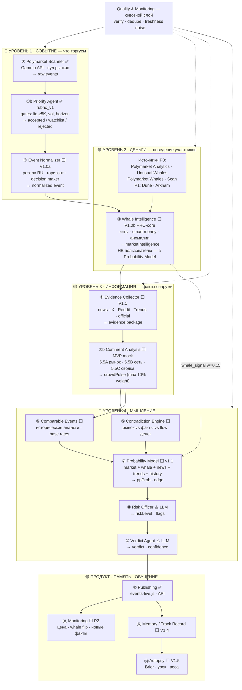
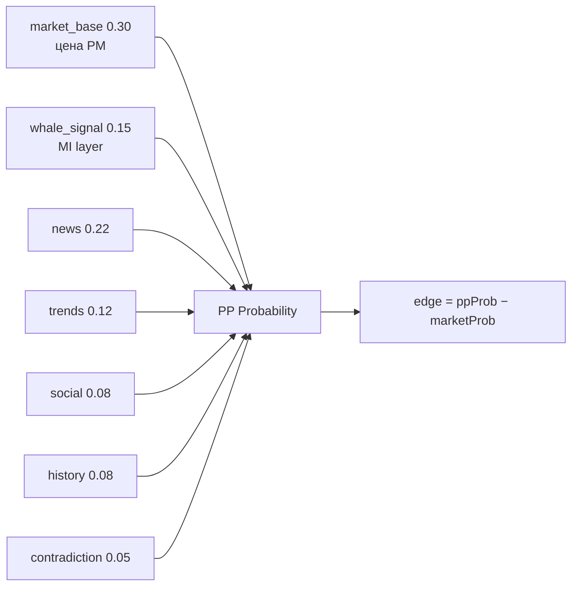
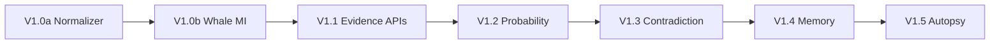
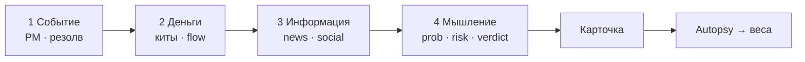

# Схема мясорубки PolyPilot — intelligence pipeline

> [[PROBABILITY_INTELLIGENCE_ENGINE]] · [[INTELLIGENCE_DATA_FLOW]] · [[AI_ARCHITECTURE_V1]] · [[АРХИТЕКТУРА_АГЕНТОВ]] · [[ДОМ_ШТАБ]] · [[ПРИОРИТЕТ_АГЕНТ]]

> **Версия:** `intelligence_v1.1` · **Главная визуальная карта** (читай этот файл)  
> Excalidraw-черновик: `СХЕМА_МЯСОРУБКИ.excalidraw` — только блоки, без деталей

**Как смотреть:** режим **просмотра** (иконка книги 📖 или `Ctrl+E`) — ниже Mermaid-схемы и таблицы.

---

## Сейчас vs цель (честно)

| | Сегодня в коде | Целевая мясорубка |
|---|----------------|-------------------|
| **Реально работает** | Scanner + Priority + один LLM-промпт + sync на сайт | 13 модулей pipeline |
| **Уровень 2 (деньги)** | ❌ нет | Whale Intelligence + MI API |
| **PP Probability** | ≈ narrative LLM | формула с весами incl. `whale_signal` |

---

## Одна фраза

**Polymarket → нормализация → разведка денег → сбор фактов → противоречия и аналоги → PP Probability → риск → вердикт → карточка → память → autopsy.**

---

## Главная схема (с ролями)

---

## Пример: почему нужен Уровень 2

| Источник | Сигнал |
|----------|--------|
| Polymarket | вероятность **45%** |
| Новости | **нейтральные** |
| Whale Intelligence | **5 топ-кошельков покупают YES** за 6 ч |

→ **сигнал**, не факт. PP сдвигает `ppProb` через `whale_signal`; Risk может поднять «flow без news».

---

## Таблица агентов (полная)

| # | Агент | Зачем | Вход | Выход | Статус | Фаза |
|---|-------|-------|------|-------|--------|------|
| 1 | **Polymarket Scanner** | Кандидаты из пула PM | Gamma API | raw events | ✅ | — |
| 1b | **Priority Agent** | Фильтр качества | raw event | accepted / rejected | ✅ `rubric_v1` | — |
| 2 | **Event Normalizer** | Понятный резолв RU | raw event | normalized | ⬜ | V1.0a |
| 3 | **Whale Intelligence** | Поведение **денег** | normalized + MI | `marketIntelligence` | ⬜ | V1.0b |
| 4 | **Evidence Collector** | Факты и narrative | normalized + APIs | evidence | ⬜ | V1.1 |
| 4b | **Comment Analysis** | Crowd Pulse 5.5A/B/C | normalized + evidence | `crowdPulse` | ⚠️ mock | MVP |
| 4c | **External Market Check** | PMA lookup 5.6 | normalized + MI + MS | `externalMarketCheck` | ⚠️ mock | MVP |
| 5 | **Contradiction Engine** | Почему рынок wrong | MI + evidence + crowdPulse + PMA + market | contradiction map | ⬜ | V1.3 |
| 6 | **Comparable Events** | Аналоги | evidence + memory | analogs[] | ⬜ | V1.3 |
| 7 | **Probability Model** | **PP Probability** | всё выше | ppProb, edge | ⬜ | V1.2 |
| 8 | **Risk Officer** | Риски | всё выше | riskLevel, flags | ⚠️ LLM | V1.0a |
| 9 | **Verdict Agent** | Итог для UX | всё выше | verdict | ⚠️ LLM | — |
| 10 | **Publishing** | Сайт / API | pipeline | events-live.js | ✅ sync | — |
| 11 | **Monitoring** | Алерты после публикации | live + whale flow | diffs | ⬜ | P2 |
| 12 | **Memory** | Track record | published card | DB | ⬜ | V1.4 |
| 13 | **Autopsy** | Урок после резолва | outcome | lesson, Brier | ⬜ | V1.5 |

**Код сегодня:** `priority.py`, `polymarket.py`, `pipeline.py` (monolithic LLM), harvest sync.

---

## Probability Model — из чего складывается ppProb

Показываем edge только если ≥5 pp и есть verified fact **или** сильный whale_signal.

---

## Что видит пользователь vs система

| Данные | Guest | Pulse | PRO | Только внутри |
|--------|-------|-------|-----|---------------|
| marketProb | ✅ | ✅ | ✅ | — |
| ppProb / edge | ❌ | ✅ | ✅ | веса модели |
| whale summary | ❌ | teaser | ✅ | адреса кошельков |
| evidence list | ❌ | ❌ | ✅ | raw API dumps |
| War Room | teaser | ✅ | ✅ | LLM raw |

---

## Gates — когда событие НЕ попадает в live

- `riskLevel = high` и confidence < 60  
- `research_required` без 2 verified news  
- edge выдуман без evidence  
- `|ppProb − market| < 3pp` и нет contradiction **и** whale neutral  

---

## Фазы реализации (что строим по порядку)

Подробно: [[AI_ARCHITECTURE_V1]] §10 · [[ДОРОЖНАЯ_КАРТА_ОНЛАЙН]]

---

## 4 уровня одним взглядом

**Инсайт:** новости нейтральны, а **деньги уже движутся** — отдельный сигнал, не замена новостям.

---

## Файлы схемы в этой папке

| Файл | Назначение |
|------|------------|
| **СХЕМА_МЯСОРУБКИ.md** | ← **визуальная карта** (Mermaid + таблицы) |
| [[PROBABILITY_INTELLIGENCE_ENGINE]] | **master pipeline** · блоки и роли |
| [[INTELLIGENCE_ENGINE_MVP]] | **v0 каждого агента** |
| [[INTELLIGENCE_DATA_FLOW]] | **JSON на каждом шаге** |
| `AI_ARCHITECTURE_V1.md` | веса, gates, site vs internal |

---

← [[ДОМ_ШТАБ]] · [[AI_ARCHITECTURE_V1]]
